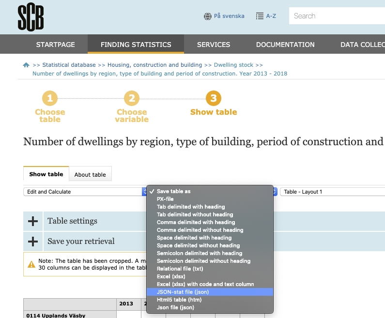

# scbapi - download SCB data

Downloading data from SCB (Statistics Sweden) using JSON is rather simple in R. This packaage provides a function that creates a `data_frame` from downloaded data in json-data format, as generated by the SCB site. 

## Using

 On the SCB website, save the data as a `JSON-stat file (json)`, in the `Save table as` listbox. See illustration below.
 
 
 
 Note: Do _not_ select the similarly named item `JSON file (json)` at the end of the same list. After downloading the file, it can be converted into a dataframe using:
 
```r
library(scbapi)
df <- scb_data(filename)
```

where `filename` is the name given to the downloaded file.


### Installing

To use, download the function in R/get_scb.R, or install the package using devtools:

```
install.packages("devtools")
devtools::install_github("bjornerstedt/scbapi")
```

## Downloading with the json-api

Alternatively, the query can be saved as a JSON-file and the dataset downloaded later.

1. Select data, for example [population data](http://www.statistikdatabasen.scb.se/pxweb/sv/ssd/START__BE__BE0101__BE0101A/BefolkningNy)
2. Click on the link: `API for this table` located below the resulting table output
3. Copy and paste the JSON code to a file with extension json, for example "cpi.json"
4. Edit the json code as indicated below.
4. Copy and paste the url in your code as shown below: `url <- "http://api.scb.se/ ..."`
5. Get the data_frame by invoking `get_scb()`. 

```r
library(scbapi)
popurl <- "http://api.scb.se/OV0104/v1/doris/sv/ssd/START/BE/BE0101/BE0101A/BefolkningNy"
df <- get_scb("cpi", url = popurl )
```
The data is returned in long format. Use `tidyr::spread` to reshape data.

## Editing the json code

The response has been changed from `"px"` to `"json-stat"`, as shown in the example below. The url can also be stored in the downloaded json-file by adding them, comma separated, as fields at the bottom:

```
{
    "query": [
... 
...
       ],
    "response": {
        "format": "json-stat"
    },
    "url": "http://api.scb.se/OV0104/v1/doris/sv/ssd/START/BE/BE0101/BE0101A/BefolkningNy",
    "weburl": "http://www.statistikdatabasen.scb.se/pxweb/sv/ssd/START__BE__BE0101__BE0101A/BefolkningNy"
}
```
I have also added the field `url` for the json search. The advantage of this approach is that the json file now contains all the information necessary to retreive the data:

```
library(scbapi)
df <- get_scb("cpi")
```

It is a little unfortunate that SCB does not put the url in the json-query. If they did, one could just download a file and execute the short command above to get the data as a data frame. 

## Limitations

The current version does not have much error checking and makes some specific assumptions about the structure of the SCB output. The program has worked for me in the downloads I have needed to do, but it is not unreasonable that it will fail with some/much output. Specifically I have assumed that there is a time dimension in the returned data, and that this is the lowest index in the data vector returned as `query$dataset$value` in the returned JSON data. It also has minimal error checking of input and the response from api.scb.se. 

When I have some free time I will check the generality in the API. But since it works for me, it might take some time before I have some time.


